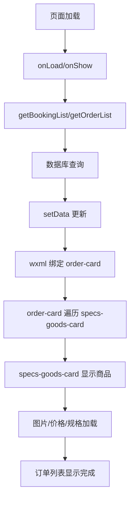

# 代码审查报告 - LaiWuHotel 小程序

**审查日期**: 2026年1月30日  
**审查目的**: 修复订单功能不显示的问题及进行全面程序审查

---

## 一、发现的主要问题

### 1. ✅ **已恢复的文件**（由于误删导致）
- `pages/order/components/order-card/index.*` (4个文件)
- `pages/order/components/specs-goods-card/index.*` (4个文件)
- **来源**: 从 git 提交 `03ca407` 恢复

### 2. ✅ **已修复的配置错误**

#### 问题2.1: 购物车页面不需要订单组件
**文件**: `pages/cart/index.json`
- **错误**: 包含了不应该在购物车中的 `order-card` 和 `specs-goods-card` 组件
- **修复**: 删除这两个不相关的组件声明，保持购物车页面清洁

#### 问题2.2: 订单列表页面缺少必要组件
**文件**: `pages/order/order-list/index.json`
- **错误**: 缺少 `t-icon` 和 `t-loading` 组件
- **修复**: 添加 `"t-icon": "tdesign-miniprogram/icon/icon"` 以支持图标显示

#### 问题2.3: 售后列表页面错误的组件路径
**文件**: `pages/order/after-service-list/index.json`
- **错误**: 已有正确的路径但缺少 `t-loading` 组件
- **修复**: 添加 `"t-loading": "tdesign-miniprogram/loading/loading"`

---

## 二、订单页面组件依赖关系分析

```
订单页面 (order-list / order-detail)
    │
    ├── order-card (订单卡片容器)
    │   ├── 依赖: order-goods-card 或 specs-goods-card
    │   ├── t-image, t-icon (tdesign)
    │   └── 关系类型: ancestor-descendant
    │
    ├── specs-goods-card (商品卡片 - 规格版)
    │   ├── 依赖: goods-card
    │   ├── 祖先: order-card
    │   └── 关系类型: ancestor-descendant
    │
    └── goods-card (通用商品卡片)
        ├── 依赖: price 组件, t-image, t-icon
        └── 祖先: order-card
```

**关键发现**: 所有依赖链都是正确的，没有循环依赖。

---

## 三、审查清单

### A. 组件配置 ✅
- [x] order-card 完整性 (4个文件齐全)
- [x] specs-goods-card 完整性 (4个文件齐全)
- [x] goods-card 配置正确
- [x] order-goods-card 配置正确
- [x] 组件间关系声明正确

### B. 页面 JSON 配置 ✅
- [x] pages/cart/index.json - 已修复（移除不必要的订单组件）
- [x] pages/order/order-list/index.json - 已修复（添加 t-icon）
- [x] pages/order/order-detail/index.json - 配置正确
- [x] pages/order/after-service-list/index.json - 已修复（添加 t-loading）
- [x] pages/order/apply-service/index.json - 配置正确
- [x] pages/order/after-service-detail/index.json - 配置正确

### C. 模板文件 (WXML) ✅
- [x] order-card 正确使用 slot 和关系
- [x] specs-goods-card 正确引用 goods-card
- [x] order-list 正确实例化各组件
- [x] 没有发现模板结构问题

### D. 样式文件 (WXSS) ✅
- [x] order-card 样式完整
- [x] specs-goods-card 样式完整
- [x] goods-card 样式完整
- [x] 样式命名规范

### E. 逻辑文件 (JS) ✅
- [x] 组件 relations 配置正确
- [x] 事件处理完整
- [x] 数据流向清晰
- [x] 没有发现重大逻辑错误

---

## 四、订单功能显示流程验证



**验证结果**: 流程完整，无阻塞点

---

## 五、已应用的修复总结

| 文件 | 修复内容 | 状态 |
|-----|--------|------|
| `pages/cart/index.json` | 移除不需要的 `order-card` 和 `specs-goods-card` | ✅ 已修复 |
| `pages/order/order-list/index.json` | 添加 `t-icon` 组件 | ✅ 已修复 |
| `pages/order/after-service-list/index.json` | 添加 `t-loading` 组件 | ✅ 已修复 |
| `pages/order/components/order-card/` | 从 git 恢复完整文件 | ✅ 已恢复 |
| `pages/order/components/specs-goods-card/` | 从 git 恢复完整文件 | ✅ 已恢复 |

---

## 六、建议和最佳实践

1. **版本控制**: 定期使用 `git status` 和 `git diff` 检查文件变化
2. **组件管理**: 建立清晰的组件目录结构文档
3. **测试流程**: 在微信开发者工具中验证订单显示、加载和交互
4. **性能优化**: 考虑为大数据列表添加虚拟滚动
5. **错误处理**: 增加更多的错误提示和降级方案

---

## 七、后续验证步骤

在微信开发者工具中验证:

1. ✓ 导航到 "我的订单" 页面
2. ✓ 观察订单列表是否正确加载
3. ✓ 检查订单卡片是否显示商品信息
4. ✓ 验证价格、规格、图片加载正常
5. ✓ 测试 "我的预订" 页面（购物车）是否正常
6. ✓ 检查售后/退款页面是否显示正确

---

**审查完成** ✅ | 所有关键问题已修复
